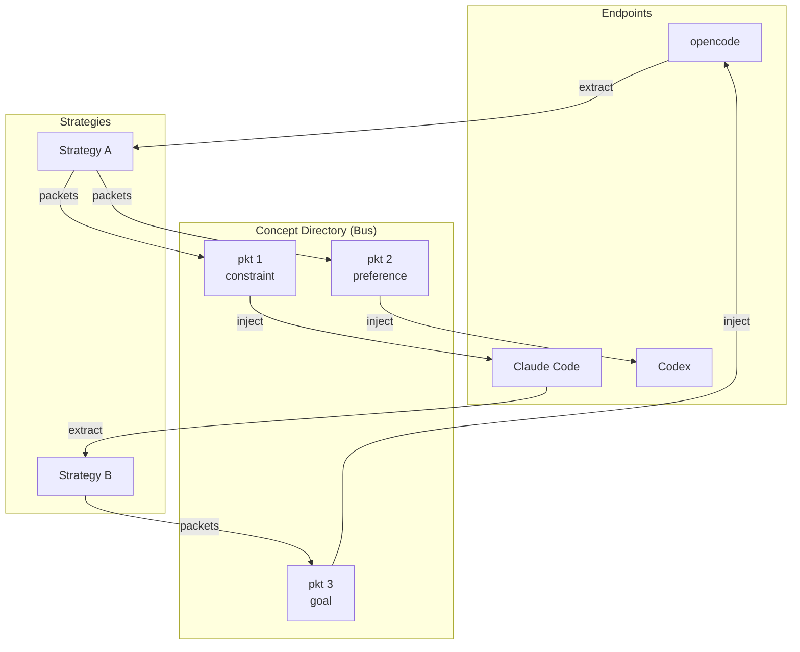

<p align="center">
<br/>
<a href=https://pypi.org/project/ctxttools></a>
</p>

Memory tools for LLM conversations. Extracted from [Gab n' Go](https://github.com/day50-dev/gabngo). Named after [GNU mtools](https://www.gnu.org/software/mtools/), which does the same thing for DOS floppies because your context window is about the size of a DOS-floppy. Maybe we can use that for inspiration.

## The Architecture

ctools is a substrate for moving memory between context windows. Cross-platform, agent-agnostic, designed like a bus.

A context is a collection of concepts extracted from a conversation under a given strategy. Constraints, preferences, goals, observations - these are the packets. Each packet has filterable headers: type, description, and content at multiple granularities (short, medium, long). The concept directory is the bus - each concept file is a packet that can be filtered, merged, edited, versioned, and transferred between any two endpoints.

Strategies are filters. They define how conversations are parsed into packets. Different strategies produce different ontologies because context is contestable. The bus doesn't care. Packets move regardless.

Context windows are endpoints. opencode, Claude Code, Codex - they all speak different protocols but they all consume the same packets. That's the point.



## The Problem

You talk to LLMs all day. Over weeks, you build up a set of constraints, preferences, and goals. These live in your conversations as system messages. They are valuable. They are also trapped.

Say you have been working with opencode for a month. You have refined your coding style through dozens of sessions. Now you start a new Claude Code project and you want those same preferences. You could copy them by hand. Or you could use ctools.

```sh
ccopy @opencode/ses_abc123 concepts/
ccopy concepts/ @claude-code/ses_xyz
```

Or skip the bus entirely:

```sh
ccopy @opencode/ses_abc123 @claude-code/ses_xyz
```

Your memory travels with you.

| GNU mtools | ctools | Does what |
|------------|--------|-----------|
| `mdir` | `cdir` | List sessions |
| `mcopy` | `ccopy` | Copy concepts |
| `mdu` | `cdu` | Token usage |
| `mtype` | `cgrep` | Search content |
| - | `cconnect` | Live pipelines |

## Tools

### ccopy

Move packets between endpoints. The `@` prefix marks a session (endpoint). Plain paths are concept directories (the bus).

```sh
ccopy @opencode/ses_abc123 concepts/              # extract packets to bus
ccopy concepts/ @opencode/ses_abc123               # inject packets from bus
ccopy @opencode/ses_abc123 @claude-code/ses_xyz   # endpoint to endpoint
ccopy --strategy my-strategy.json @opencode/ses_abc123 concepts/  # custom filter
```

Each concept file is a packet with filterable headers:

```json
{
  "type": "constraint",
  "description": "C coding standard",
  "short": "Use C17 standard",
  "medium": "Always compile with -std=c17 and enforce strict pointer checking",
  "long": "All C code must target the C17 standard. Use -std=c17 -Wall -Wextra..."
}
```

Strategies define the filter - how conversations are parsed into packets. Ontology is contestable, so different strategies produce different chunkings:

```json
{
  "host": "http://localhost:11434",
  "model": "qwen2.5:3b",
  "api_key": null,
  "prompt": "Extract the key concepts from this conversation..."
}
```

### cdir

Lists sessions (endpoints). Think `ls` for your conversation history. Subagents appear indented under their parent with tree connectors.

```sh
cdir                        # list all known agents
cdir opencode/              # sessions for opencode
cdir claude-code/           # sessions for claude code
cdir -R                     # all agents, recursive
cdir opencode/ses_abc123    # export a session as JSON
```

Output shows Found/Not Found with actual paths:

```
Found:
  Claude Code  Claude Code CLI             ~/.claude/projects/
  Opencode     Opencode CLI                ~/.local/share/opencode/opencode.db

Not Found:
  Claude       Claude Desktop (Anthropic)  ~/.config/Claude/conversations/
  Codex        OpenAI Codex CLI            ~/.codex/sessions/
```

Sort by time (`-t`), size (`-s`), reverse (`-r`). Output as json, xml, or markdown with `-f`.

### cconnect

Connect context windows via live concept pipelines. Exposes concepts from one session as a toolcall in another session's context. Real-time agent composition.

```sh
cconnect @opencode/ses_abc @claude-code/ses_xyz           # connect endpoints
cconnect @opencode/ses_abc/concepts/ @claude-code/ses_xyz # from concept directory
cconnect --strategy my-strategy.json @opencode/ses_abc @claude-code/ses_xyz  # custom extraction
cconnect --filter my-filter.json @opencode/ses_abc @claude-code/ses_xyz      # filter concepts
```

Use case: Agent A is doing a long task (find most relevant document, 10 hours). Agent B needs that output. cconnect creates a live pipeline so Agent B gets concepts from Agent A as they're produced.

```sh
# Agent A starts a long task
# Meanwhile, connect Agent A's output to Agent B's context
cconnect @opencode/ses_long_task @claude-code/ses_next_step

# Agent B now has access to Agent A's concepts as a toolcall
```

Filter configuration:

```json
{
  "types": ["constraint", "preference"],
  "exclude_types": ["observation"],
  "prompt": "coding"
}
```

### cgrep

Searches packet content across the bus. Regex supported. Works across all endpoints.

```sh
cgrep "pattern" "opencode/*"
cgrep -i "error" "claude-code/"
cgrep -c "def " "opencode/"              # count per session
cgrep -C 2 "exception" "claude-code/"    # context lines
cgrep "TODO" "opencode/" "claude-code/"  # multiple agents
```

Flags: `-l` list files, `-c` count, `-v` invert, `-i` case-insensitive, `-A/-B/-C` context.

### cdu

Token usage. Like `du` but for context windows. Uses tiktoken for accurate counts.

```sh
cdu                           # total across all agents
cdu opencode/                 # sessions by token count
cdu opencode/ses_abc123       # breakdown by role
cdu --json opencode/          # machine-readable
```

For opencode, it reads actual input/output tokens from the database. For other agents, it counts with tiktoken from the conversation content.

## Supported Endpoints

| Agent | Storage |
|-------|---------|
| claude | JSON |
| claude-code | JSONL |
| opencode | SQLite |
| codex | JSONL |

Run `cdir` to see which endpoints are found on your system and where they store data.

## MCP Server

There is an MCP server for use from Claude, opencode, Cursor, or anything else that speaks MCP.

Tools: `list_agents`, `list_sessions`, `search_sessions`, `export_session`, `extract_concepts`, `copy_concepts`, `get_session_concepts`.

Add to your MCP config:

```json
{
  "mcpServers": {
    "ctools": {
      "command": "python",
      "args": ["/ABSOLUTE/PATH/TO/ctools/ctools_mcp.py"]
    }
  }
}
```

## Installation

```sh
pip install ctxttools
```

For MCP server support:

```sh
pip install ctxttools[mcp]
```

## Library

Works as a Python library too.

```python
from ctools.lib import AGENTS, get_formatter
from ctools.cdir import get_opencode_sessions
from ctools.cgrep import grep_session
from ctools.ccopy import extract_concepts_from_messages, inject_concepts_to_session
from ctools.cdu import count_tokens, get_session_tokens
```
