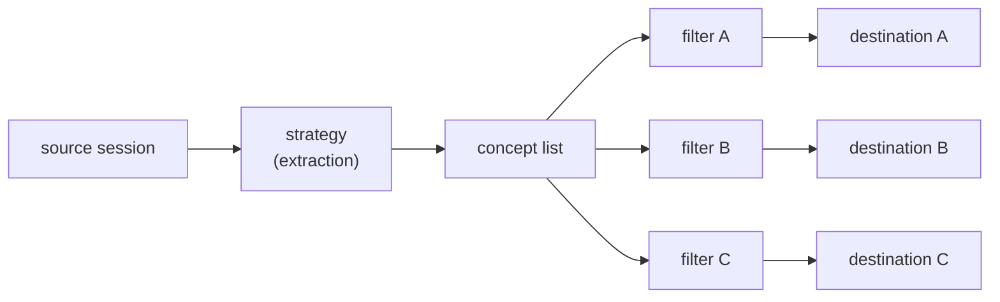

# ctools

**Two things you can't do any other way.**

### 1. `cgrep` — find it in your past conversations

You already know the answer is in a session you had months ago. You just don't remember which one. `cgrep` searches **every session you ever had, across every agent you use**, with a plain regex:

```shell
$ cgrep -i "ssl"
claude-code/a351eedf:142:assistant: … the TLS handshake fails with SSL wrong version number …
opencode/ses_000d460f:16:user: ok graflex has an erorr in the check. i see this: … [[SSL: WRONG_VERSION_NUMBER] …
opencode/ses_000d460f:34:assistant: Found it. Root cause: `_check_host` (graflex/__init__.py:128) tries `http`, and …
```

No agent argument? It searches **every installed agent at once** — Claude Code, Opencode, Kilo, Codex, Pi, Goose, Hermes, Cline, omp, and Freebuff, all in one pass. That last line is the root-cause analysis you wrote six months ago and would never have found again.

### 2. `ccopy` — move your project from one tool to another

Switched from opencode to Claude Code mid-project? You don't have to start from zero. Copy the whole conversation — context, decisions, the lot — into a fresh session in the other tool:

```shell
$ ccopy opencode/ses_abc123 claude-code
Copied 128 message(s) from opencode/ses_abc123 to a new claude-code session: 1a2b3c
Resume it with:
  claude-code --resume 1a2b3c
```

Your work travels with you. The source is never touched, so it's a true copy.

---

<p align="center">
<br/>
<a href=https://pypi.org/project/ctxttools></a>
</p>

ctools is a set of GNU-style tools for the history your coding agents leave behind. These two are the headline; the rest (`cdir` to list sessions, `cextract` to move concepts, `cconnect` to pipe them live, `cdu` to count tokens, `crm` to prune) are in service of them.

**Works with the agents you already use:** Claude Desktop, Claude Code, Opencode, Kilo, Codex, Pi, Goose, Hermes, Cline, omp (oh-my-pi), and Freebuff (Codebuff).

## Tools

| Tool | What it does | Docs |
|------|--------------|------|
| `cgrep` | Search conversation content (grep across every agent) | [docs/cgrep.md](docs/cgrep.md) |
| `cdir` | List sessions (ls for your history) | [docs/cdir.md](docs/cdir.md) |
| `ccopy` | Copy a whole conversation from one agent to a new session in another | [docs/ccopy.md](docs/ccopy.md) |
| `cextract` | Extract concepts from a session into files, and inject them back | [docs/cextract.md](docs/cextract.md) |
| `cconnect` | Live concept pipelines between sessions | [docs/cconnect.md](docs/cconnect.md) |
| `cdu` | Token usage per session (du for context windows) | [docs/cdu.md](docs/cdu.md) |
| `crm` | Remove concepts from a session (mdel) | [docs/crm.md](docs/crm.md) |

Every tool takes `--version` and `--verbose` (structured logging). Each tool's full flag reference, output formats, and examples live in its `docs/` page — the table above is just the 30-second version.

## How it works

ctools is a substrate for moving memory between context windows. Cross-platform, agent-agnostic, designed like a bus.

Two stages: **extraction** and **filtering**.

- A **strategy** extracts concepts from a conversation. It defines what counts as a concept and how to find it: regex patterns, LLM extraction, whatever. Different strategies produce different ontologies from the same conversation, because context is contestable.
- A **filter** selects which extracted concepts reach a destination. It's a binary classifier: pass through or filter out. One concept list can fan out to many destinations, each with its own filter. A coding agent gets coding preferences, a security agent gets security constraints, a PM agent gets goals, all from the same source.


```mermaid
graph LR
    SRC["source session"] --> STRAT["strategy<br/>(extraction)"]
    STRAT --> CONCEPTS["concept list"]
    CONCEPTS --> FA["filter A"]
    CONCEPTS --> FB["filter B"]
    CONCEPTS --> FC["filter C"]
    FA --> DEST_A["destination A"]
    FB --> DEST_B["destination B"]
    FC --> DEST_C["destination C"]
```

Context windows are endpoints: opencode, Claude Code, Codex, Pi. They all speak different protocols, but they all consume the same packets. See [cextract](docs/cextract.md) for the concept packet format, strategies, and the filter (JSON-RPC) protocol.

## The problem

You talk to LLMs all day. Over weeks, you build up a set of constraints, preferences, and goals. These live in your conversations as system messages. They are valuable. They are also trapped.

Say you have been working with opencode for a month. You have refined your coding style through dozens of sessions. Now you start a new Claude Code project and you want those same preferences. You could copy them by hand. Or you could `cextract` them out and `cextract` them back in, or copy the whole conversation across with `ccopy`. Either way, your memory travels with you.

## Supported endpoints

| Agent | Storage |
|-------|---------|
| claude | JSON |
| claude-code | JSONL |
| opencode | SQLite |
| kilo | SQLite (opencode fork, same schema) |
| codex | JSONL |
| pi | JSONL |
| goose | SQLite |
| hermes | SQLite (`~/.hermes/state.db`, `$HERMES_HOME`) |
| cline | JSON (`~/.cline/data/tasks/`) |
| omp | JSONL (`~/.omp/agent/sessions/`, tree journal) |
| freebuff | JSON (`~/.config/<codebuff>/projects/`) |

Run `cdir` to see which endpoints are found on your system and where they store data.

Every endpoint is one class in `ctools/agents.py`. The base `Agent` defines the whole interface the tools use — `sessions()`, `messages()`, `raw_messages()`, `lines()`, `inject_system()`, `inject_toolcall()`, `remove_messages()`, `create_session()` — and the storage-shaped subclasses (`JsonAgent`, `JsonlAgent`, `SqliteAgent`) implement most of it. Adding an endpoint means writing one subclass and adding it to `AGENT_CLASSES`; no command changes.

```python
from ctools.agents import JsonlAgent, Session

class MyAgent(JsonlAgent):
    name = 'myagent'
    description = 'My Coding Agent'
    session_pattern = 'sessions/**/*.jsonl'

    @classmethod
    def default_base_path(cls):
        return Path.home() / '.myagent'

    def sessions(self):
        ...
```

Anything the storage cannot do — pi's session trees cannot be rewritten in place — raises `UnsupportedOperation` instead of being silently skipped.

## MCP server

There is an MCP server for use from Claude, opencode, Cursor, or anything else that speaks MCP.

Tools: `list_agents`, `list_sessions`, `search_sessions`, `export_session`, `extract_concepts`, `copy_concepts`, `get_session_concepts`.

Add to your MCP config:

```json
{
  "mcpServers": {
    "ctools": {
      "command": "python",
      "args": ["/ABSOLUTE/PATH/TO/ctools/ctools_mcp.py"]
    }
  }
}
```

## Installation

```sh
pip install ctxttools
```

For MCP server support:

```sh
pip install ctxttools[mcp]
```

## Library

Works as a Python library too.

```python
from ctools.agents import REGISTRY, OpencodeAgent, SessionNotFound
from ctools.lib import get_formatter
from ctools.cgrep import grep_session
from ctools.cextract import extract_concepts_from_messages
from ctools.cdu import count_tokens, get_session_tokens
from ctools.filterlib import JSONRPCFilter, load_filter
from ctools.log import configure_logging, get_logger
```

Everything goes through an agent:

```python
from ctools.agents import REGISTRY

agent = REGISTRY['opencode']
for session in agent.sessions():
    print(session.id, session.name, session.size)

for message in agent.messages('ses_abc123'):
    print(message.role, message.content)
```

Point an agent somewhere else by constructing it with a path:

```python
from ctools.agents import OpencodeAgent

agent = OpencodeAgent('/backup/opencode')
```

## Credits

ctools was extracted from [Gab n' Go](https://github.com/day50-dev/gabngo). It's named after [GNU mtools](https://www.gnu.org/software/mtools/), which does the same thing for DOS floppies — because your context window is about the size of a DOS-floppy. The flag habits are GNU's too: `--version`, `-1`, `-S`, `-u`, and the rest behave the way you'd expect.
