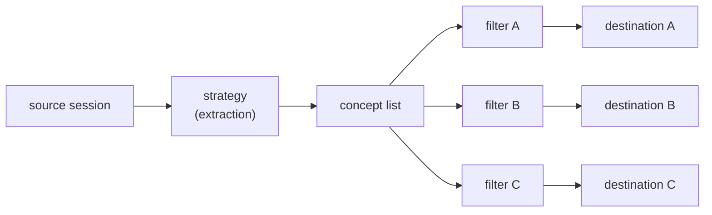

<p align="center">
<br/>
<a href=https://pypi.org/project/ctxttools></a>
<br/><br/><b>Try it now</b><br/>
<code>uvx --from ctxttools cdir</code>
<br/><br/><b>Then install it</b><br/>
<code>uv tool install ctxttools</code>
</p>

------
**ctools** is a suite of simple tools for navigating through the sessions of the most popular LLM agents and coding tools. It allows you to search your history, transfer conversations, filter them, and even share them among machines and users.

It supports [Claude Desktop](https://claude.com/download), [Claude Code](https://github.com/anthropics/claude-code), [Codex](https://github.com/openai/codex), [Pi](https://github.com/earendil-works/pi), [Hermes](https://github.com/NousResearch/hermes-agent), [Goose](https://github.com/aaif-goose/goose), [Kilo](https://github.com/Kilo-Org/kilocode), [FreeBuff](https://github.com/CodebuffAI/freebuff), [Cline](https://github.com/cline/cline), [omp](https://github.com/can1357/oh-my-pi), and [OpenClaw](https://openclaw.ai/).

Here's an example:

> I look for mentions of snake game in opencode using cgrep
<pre>
$ <b>cgrep</b> "snake game" opencode
opencode/ses_a1d1a5a4df984ee698cab4a7:1:user: make a simple snake game in python
opencode/ses_a1d1a5a4df984ee698cab4a7:2:assistant: I'll make a terminal-based snake game using `curses` (standard library, no dependencies).
opencode/ses_a1d1a5a4df984ee698cab4a7:3:assistant: Done — `snake.py` is a terminal snake game using Python's built-in `curses` module (no dependencies).
</pre>

> cool let's look at the status of that session using cdir
<pre>
$ <b>cdir</b> -l opencode/ses_a1d1a5a4df984ee698cab4a7
  ID                            NAME                                MODIFIED            SIZE  MSGS  PATH
  ses_a1d1a5a4df984ee698cab4a7  make a simple snake game in python  2026-10-07 16:56  2.7 KB     3  /home/chris/.local/share/opencode

  1 session(s)
</pre>

> Alright let's copy that session from opencode into pi!
<pre>
$ <b>ccopy</b> opencode/ses_a1d1a5a4df984ee698cab4a7 pi
Copied 3 message(s) from opencode/ses_a1d1a5a4df984ee698cab4a7 to a new pi session: e357f435-f813-463a-b313-f97f1051f3cb
Resume it with:
  pi --session e357f435-f813-463a-b313-f97f1051f3cb
</pre>

As you can see, these are unix-friendly tools using simple paradigms that you are already familiar with.

## Tools

| Tool | What it does | Docs |
|------|--------------|------|
| `cgrep` | Search conversation content (grep across every agent) | [docs/cgrep.md](docs/cgrep.md) |
| `cdir` | List sessions (ls for your history) | [docs/cdir.md](docs/cdir.md) |
| `ccat` | Print one or more conversations (cat for your history) | [docs/ccat.md](docs/ccat.md) |
| `ccopy` | Copy a whole conversation from one agent to a new session in another | [docs/ccopy.md](docs/ccopy.md) |
| `cextract` | Extract concepts from a session into files, and inject them back | [docs/cextract.md](docs/cextract.md) |
| `cconnect` | Live concept pipelines between sessions | [docs/cconnect.md](docs/cconnect.md) |
| `cdu` | Token usage per session (du for context windows) | [docs/cdu.md](docs/cdu.md) |
| `crm` | Remove concepts from a session (mdel) | [docs/crm.md](docs/crm.md) |
| `ctools-web` | Browser dashboard for all of the above | [Web dashboard](#web-dashboard) |

Every tool takes `--version`. The session-mover tools (`ccopy`, `cextract`, `cconnect`, `crm`) also take `--verbose` for structured logging. Each tool's full flag reference, output formats, and examples live in its `docs/` page — the table above is just the 30-second version.

## The problem

You talk to LLMs all day. Over weeks, you build up a set of constraints, preferences, and goals. These live in your conversations as system messages. They are valuable. They are also trapped.

Say you have been working with opencode for a month. You have refined your coding style through dozens of sessions. Now you start a new Claude Code project and you want those same preferences. You could copy them by hand. Or you could `cextract` them out and `cextract` them back in, or copy the whole conversation across with `ccopy`. Either way, your memory travels with you.

## How it works

ctools is a substrate for moving memory between context windows. Cross-platform, agent-agnostic, designed like a bus.

Two stages: **extraction** and **filtering**.

- A **strategy** extracts concepts from a conversation. It defines what counts as a concept and how to find it: regex patterns, LLM extraction, whatever. Different strategies produce different ontologies from the same conversation, because context is contestable.
- A **filter** selects which extracted concepts reach a destination. It's a binary classifier: pass through or filter out. One concept list can fan out to many destinations, each with its own filter. A coding agent gets coding preferences, a security agent gets security constraints, a PM agent gets goals, all from the same source.

A filter can be as simple as a type or substring match, or as smart as a **decision model** — a small local classifier that scores each concept and lets it through only when confident. Point a filter at a model and you get *semantic* filtering with no free text to parse: ask "is this concept about security?" and gate on the answer. The model is asked either through Ollama's typed `/v1/systemone` endpoint (calibrated probabilities, the home of decision-dedicated models) or through any OpenAI-compatible `/v1/chat/completions` server (portable, lettered decision-task prompt) — one `endpoint` field decides. See [cextract](docs/cextract.md) for the decision-model and JSON-RPC filter configs.


```mermaid
graph LR
    SRC["source session"] --> STRAT["strategy<br/>(extraction)"]
    STRAT --> CONCEPTS["concept list"]
    CONCEPTS --> FA["filter A"]
    CONCEPTS --> FB["filter B"]
    CONCEPTS --> FC["filter C"]
    FA --> DEST_A["destination A"]
    FB --> DEST_B["destination B"]
    FC --> DEST_C["destination C"]
```

Context windows are endpoints: opencode, Claude Code, Codex, Pi. They all speak different protocols, but they all consume the same packets. See [cextract](docs/cextract.md) for the concept packet format, strategies, and the filter configs (decision model and JSON-RPC).

## Supported endpoints

| Agent | Storage |
|-------|---------|
| claude | JSON |
| claude-code | JSONL |
| opencode | SQLite |
| kilo | SQLite (opencode fork, same schema) |
| codex | JSONL |
| pi | JSONL |
| goose | SQLite |
| hermes | SQLite (`~/.hermes/state.db`, `$HERMES_HOME`) |
| cline | JSON (`~/.cline/data/tasks/`) |
| omp | JSONL (`~/.omp/agent/sessions/`, tree journal) |
| freebuff | JSON (`~/.config/<codebuff>/projects/`) |
| openclaw | SQLite (per-agent, `~/.openclaw/agents/`, `OPENCLAW_STATE_DIR`) |

OpenClaw is a **personal assistant** rather than a terminal coding agent, so it
runs in a local Gateway that owns its store; ctools reads and exports its
sessions but does not seed new ones (the store has canonical-index and integrity
checks that a raw insert cannot satisfy).

Run `cdir` to see which endpoints are found on your system and where they store data.

Every endpoint is one class in `ctools/agents.py`. The base `Agent` defines the whole interface the tools use — `sessions()`, `messages()`, `raw_messages()`, `lines()`, `inject_system()`, `inject_toolcall()`, `remove_messages()`, `create_session()` — and the storage-shaped subclasses (`JsonAgent`, `JsonlAgent`, `SqliteAgent`) implement most of it. Adding an endpoint means writing one subclass and adding it to `AGENT_CLASSES`; no command changes.

```python
from ctools.agents import JsonlAgent, Session

class MyAgent(JsonlAgent):
    name = 'myagent'
    description = 'My Coding Agent'
    session_pattern = 'sessions/**/*.jsonl'

    @classmethod
    def default_base_path(cls):
        return Path.home() / '.myagent'

    def sessions(self):
        ...
```

Anything the storage cannot do — pi's session trees cannot be rewritten in place — raises `UnsupportedOperation` instead of being silently skipped.

## MCP server

There is an MCP server for use from Claude, opencode, Cursor, or anything else that speaks MCP.

Tools: `list_agents`, `list_sessions`, `search_sessions`, `export_session`, `extract_concepts`, `copy_concepts`, `get_session_concepts`.

Add to your MCP config:

```json
{
  "mcpServers": {
    "ctools": {
      "command": "python",
      "args": ["/ABSOLUTE/PATH/TO/ctools/ctools_mcp.py"]
    }
  }
}
```

## Web dashboard

Prefer a mouse to a man page? ctools ships a browser dashboard — a small local
web server (Python stdlib only, no web dependencies) with the same library
underneath. Same on macOS, Windows, and Linux:

```sh
$ ctools-web                 # or: python -m ctools.webui
ctools 0.2.1 dashboard: http://127.0.0.1:8765
```

Open the URL. You get four views:

- **Overview** — every supported agent, installed or not, with session counts
  and total tokens, and a jump into each agent's sessions.
- **Search** — `cgrep` in the browser: one regex box, per-agent chips, live
  matches; click any match to open that conversation.
- **Sessions** — `cdir` for one agent: newest, largest, or by token usage.
- **Conversation** — `ccat` with the source session's messages, token usage,
  the resume command, concept extraction (`cextract`), a markdown export,
  and **Copy** — `ccopy` to any other installed agent, which creates a fresh
  session there (source untouched) and tells you how to resume it.

The server binds to `127.0.0.1` by default, so nothing is exposed to your
network unless you pass `--host 0.0.0.0`. There is one write operation:
Copy. Everything else is read-only against the agents' storage.

```sh
ctools-web --port 9000
```

## Installation

```sh
pip install ctxttools
```

For MCP server support:

```sh
pip install ctxttools[mcp]
```

## Library

Works as a Python library too.

```python
from ctools.agents import REGISTRY, OpencodeAgent, SessionNotFound
from ctools.lib import get_formatter
from ctools.cgrep import grep_session
from ctools.cextract import extract_concepts_from_messages
from ctools.cdu import count_tokens, get_session_tokens
from ctools.filterlib import JSONRPCFilter, SystemOneFilter, load_filter
from ctools.log import configure_logging, get_logger
```

Everything goes through an agent:

```python
from ctools.agents import REGISTRY

agent = REGISTRY['opencode']
for session in agent.sessions():
    print(session.id, session.name, session.size)

for message in agent.messages('ses_abc123'):
    print(message.role, message.content)
```

Point an agent somewhere else by constructing it with a path:

```python
from ctools.agents import OpencodeAgent

agent = OpencodeAgent('/backup/opencode')
```

## Where to go next

- **Per-tool reference** — the [Tools](#tools) table above links to a `docs/` page for each command: every flag, output format, and a worked example.
- **The interchange format** — how a conversation becomes a portable, lossless envelope and back, and why 2N agents compose into N² transfers. See [interchange](docs/interchange.md).
- **Filtering with decision models** — the full decision-model and JSON-RPC filter configs, with live examples. See [cextract](docs/cextract.md#filters) and [cconnect](docs/cconnect.md#filter-configuration).
- **Adding an endpoint** — one `Agent` subclass plus a line in `AGENT_CLASSES`. See [Supported endpoints](#supported-endpoints).

## Credits

ctools was extracted from [Gab n' Go](https://github.com/day50-dev/gabngo). It's named after [GNU mtools](https://www.gnu.org/software/mtools/), which does the same thing for DOS floppies — because your context window is about the size of a DOS-floppy. The flag habits are GNU's too: `--version`, `-1`, `-S`, `-u`, and the rest behave the way you'd expect.
